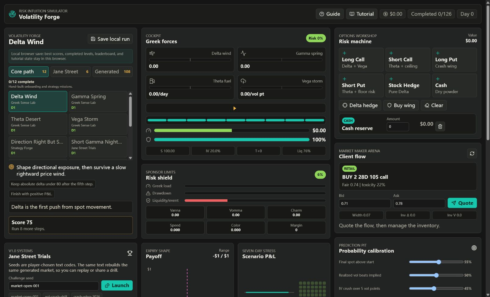
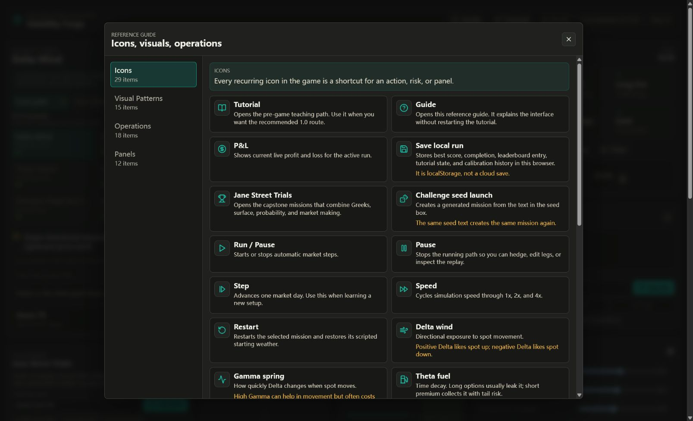
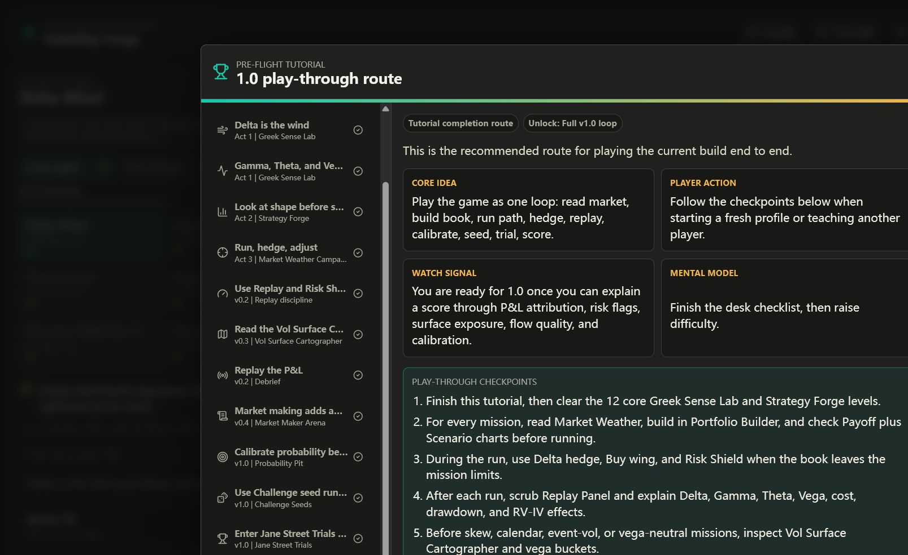
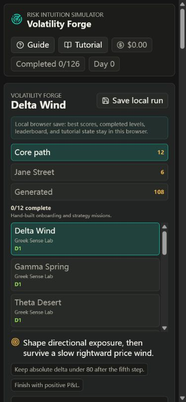

# Volatility Forge

一个用于训练期权 Greeks、波动率曲面、做市报价和风险归因直觉的浏览器游戏。

Volatility Forge 把期权组合拆成可以操作的风险机器：玩家选择关卡、搭建持仓、读取市场天气、运行路径、做 Delta hedge 或 tail protection，然后用回放归因解释这次 P&L 到底来自方向、Gamma、Theta、Vega、交易成本还是隐藏风险。

> 这是一个教育和训练用途的模拟器，不连接真实交易账户，不构成投资建议。

## 两个可运行版本

- **Web 原型**：现有 Vite + React 版本，保留完整的三栏研究工作台与 126 个任务入口。
- **Godot 2D 版**：位于 [`godot/`](godot/README.md)，把流程重排为 `Mission → Build → Run → Review`，加入固定结算周期、正式/练习隔离、预提交概率、真实报价成交、不可删除的审计轨迹和更适合触控的 2D 界面。

运行 Godot 版：

```powershell
godot --path godot
```

验证两个版本：

```powershell
npm run verify:all
```

## Screenshots

### 桌面主界面



### 内置参考指南



### 新手教程路线



### 移动端布局



## 核心玩法

1. 选择任务：从 12 个核心关卡、6 个 Jane Street Trials、108 个程序化关卡中选择一个风险场景。
2. 读取市场天气：观察 spot、IV、liquidity、event risk、skew、term structure 和市场 regime。
3. 搭建组合：添加 long/short call、long/short put、stock hedge、cash，并调整 strike、expiry、IV、quantity。
4. 运行市场：逐步推进或自动运行，市场会更新 spot、volatility、time decay、liquidity 和事件冲击。
5. 管理风险：用 Delta hedge、Buy wing、清仓或重建组合处理风险。
6. 复盘归因：查看 P&L attribution、drawdown、risk violations、RV-IV、transaction cost 和 replay timeline。
7. 保存成绩：合格 run 可以写入浏览器本地 leaderboard。

## 功能亮点

- Greek cockpit：用 Delta wind、Gamma spring、Theta fuel、Vega storm 把抽象 Greeks 转成可视化力量。
- 高阶 Greeks：展示 Vanna、Vomma、Charm、Speed、Color，帮助理解非线性风险。
- 期权组合编辑器：支持期权、股票、现金腿的新增、修改和删除。
- Payoff / Scenario charts：同时看 expiry payoff 和七日 spot/IV stress。
- Vol Surface Cartographer：用 skew、term slope、surface shock 和 Vega bucket 观察曲面风险。
- Risk Shield：把 Greek load、drawdown、liquidity/event pressure 转成任务风险预算。
- Replay Panel：每一步市场路径都有记录，方便复盘 P&L 来源。
- Market Maker Arena：练习客户流报价、quote width、toxic flow 和 inventory Greeks。
- Probability Pit：用 Brier score 训练概率校准，而不是只看交易盈亏。
- Challenge seeds：输入同一个 seed 会生成同一个挑战，适合复盘和分享。
- Local progress：关卡进度、最好成绩、leaderboard 和校准历史保存在浏览器 localStorage。

## 技术栈

- React 18
- TypeScript
- Vite
- lucide-react
- 自研 Black-Scholes、portfolio、market simulator、vol surface、P&L attribution 引擎

## 本地运行

```bash
npm install
npm run dev
```

打开 Vite 输出的本地地址，默认是：

```text
http://127.0.0.1:5173
```

## 构建与验证

```bash
npm run build
npm run goal-audit
npm run verify
```

`npm run verify` 会先执行 TypeScript/Vite 生产构建，再运行项目自带的目标审计脚本。

## 脚本说明

| Script | 用途 |
| --- | --- |
| `npm run dev` | 启动本地开发服务器 |
| `npm run build` | TypeScript 检查并生成生产构建 |
| `npm run preview` | 本地预览生产构建 |
| `npm run goal-audit` | 检查核心玩法与 v1.0 功能是否仍然接线完整 |
| `npm run verify` | build + goal-audit |
| `npm run godot:verify` | Godot 解析、规则、引擎、主流程与场景冒烟测试 |
| `npm run verify:all` | 同时验证 Web 与 Godot 两个版本 |

## 目录结构

```text
src/
  app/                 # 应用入口和全局状态编排
  components/          # 游戏面板、图表、教程、指南和交互控件
  engine/              # 定价、Greeks、市场模拟、组合汇总和归因逻辑
  game/                # 关卡、教程、评分、进度、随机挑战生成
  styles/              # 全局样式与响应式布局
  types.ts             # 共享类型定义
scripts/
  goal-audit.mjs       # 功能完整性审计脚本
docs/screenshots/      # README 截图资源
```

## 数据与隐私

项目使用模拟市场数据，不需要真实行情账号或交易 API。浏览器内的进度保存在 `localStorage`，不会自动同步到云端。提交到 Git 前不要加入个人账号、API key、日志或本地构建产物；当前 `.gitignore` 已排除 `node_modules/`、`dist/`、`*.log` 和 `*.tsbuildinfo`。

## 适合谁

- 想用交互方式理解期权 Greeks 的学习者。
- 想练习 Gamma scalping、short premium、event vol、surface twist 等策略直觉的交易员。
- 想用可重复 seed 做风险复盘和教学演示的人。
- 想研究 React + TypeScript 如何组织一个金融教育游戏的人。
